<div align="center">
  
</div>

<div align="center">
  
</div>

<p align="center">
  <a href="https://hasnain.codesphere.agency" target="_blank">
    
  </a>
  <a href="https://hasnainm.hashnode.dev" target="_blank">
    
  </a>
  <a href="https://linkedin.com/in/hasnain-makada-5b47271aa" target="_blank">
    
  </a>
  <a href="https://twitter.com/Hasnain_Makada" target="_blank">
    
  </a>
  <a href="mailto:hasnainmakada@gmail.com">
    
  </a>
</p>

<div align="center">
  
  
  
</div>

<br>

<div align="center">

> "You either die a hero, or you live long enough to see yourself become the villain."

</div>

<br>

## 👨‍💻 DEVELOPER PROFILE

```typescript
interface Developer {
  name: string;
  location: string;
  role: string;
  company: string;
  skills: string[];
  focus: string[];
  philosophy: string;
}

const hasnain: Developer = {
  name: "Hasnain Makada",
  location: "India 🇮🇳",
  role: "Full Stack Engineer & Cloud Architect",
  company: "CodeSphere Agency",
  
  skills: [
    "☁️  Cloud Architecture (Azure, AWS, GCP)",
    "🐳  Container Orchestration (Kubernetes, Docker)",
    "📱  Cross-platform Mobile Development (Flutter)",
    "🔄  CI/CD Pipeline Automation",
    "🏗️  Infrastructure as Code (Terraform)",
    "🤖  AI/ML Integration",
  ],
  
  focus: [
    "Scalable Microservices Architecture",
    "High-Performance Mobile Applications",
    "DevOps Best Practices"
  ],
  
  philosophy: "Building robust, scalable digital solutions that solve real-world problems."
};

console.log(`Initializing environment for ${hasnain.name}... 🚀`);
```

<br clear="right"/>

## 🚀 CURRENT PROJECTS & IMPACT

<div align="center">

<table>
<tr>
<td width="50%" valign="top">

### 🏗️ ENGINEERING LEAD


- **🏢 [CodeSphere Agency](https://hasnain.codesphere.agency)** 
  - Spearheading digital transformation projects
  - Delivering enterprise-grade web & mobile solutions
  - 20+ successful project deployments
  
- **📱 Mobile Engineering**
  - Advanced Flutter application development
  - Native performance optimization
  - Complex state management & architecture
  
- **☁️ Cloud Operations**
  - Designing resilient cloud infrastructure
  - Kubernetes cluster management
  - Automated deployment pipelines
  
- **🎓 Technical Mentorship**
  - Guiding 500+ developers
  - Conducting technical workshops
  - Code reviews & architectural guidance

</td>
<td width="50%" valign="top">

### 🌍 COMMUNITY IMPACT


- **🌟 [Open Source Initiative](https://github.com/hasnainmakada-99/Open-Source-With-Hasnain)**
  - Managing a community of 300+ contributors
  - Curating beginner-friendly issues
  - Fostering open source collaboration
  
- **📝 Technical Writing**
  - Authoring deep-dive articles on [Hashnode](https://hasnainm.hashnode.dev)
  - 100K+ total readership
  - Topics: DevOps, Cloud, Flutter
  
- **🎤 Public Speaking**
  - Tech conference speaker
  - Community meetup organizer
  - Sharing knowledge on modern tech stacks
  
- **🤝 Professional Network**
  - Showwcase Elite Member
  - Connecting developers globally
  - Building professional alliances

</td>
</tr>
</table>

</div>

---

## 🛠️ TECH STACK & TOOLS

<div align="center">

### 💻 Languages
<p>
  
</p>

### ⚡ Frameworks & Libraries
<p>
  
</p>

### ☁️ Cloud & DevOps
<p>
  
</p>

### 🗄️ Databases
<p>
  
</p>

### 🔧 Tools & Platforms
<p>
  
</p>

</div>

<details>
<summary>🔍 <strong>Detailed Technical Proficiency</strong></summary>
<br>

<div align="center">

| Category | Technologies | Proficiency |
|----------|-------------|-------------|
| **Mobile Development** | Flutter • Dart • Firebase • SQLite • Provider • Bloc • GetX | ⭐⭐⭐⭐⭐ |
| **Backend Development** | Python • Go • Node.js • FastAPI • Django • Express.js | ⭐⭐⭐⭐⭐ |
| **Frontend Development** | React • Next.js • JavaScript • TypeScript • Tailwind CSS | ⭐⭐⭐⭐ |
| **DevOps & CI/CD** | Docker • Kubernetes • Jenkins • GitLab CI • GitHub Actions | ⭐⭐⭐⭐⭐ |
| **Cloud Platforms** | Microsoft Azure • AWS • Google Cloud Platform • DigitalOcean | ⭐⭐⭐⭐⭐ |
| **IaC & Config** | Terraform • Ansible • ARM Templates • CloudFormation | ⭐⭐⭐⭐ |
| **Databases** | MongoDB • PostgreSQL • MySQL • Redis • Firebase Firestore | ⭐⭐⭐⭐⭐ |
| **Monitoring** | Grafana • Prometheus • ELK Stack • Azure Monitor | ⭐⭐⭐⭐ |

</div>

</details>

---

## 📊 GITHUB ANALYTICS

<div align="center">
  
### 📈 Activity Overview
  
<p align="center">
  
  
</p>

### ⚡ Contribution Streak

<p align="center">
  
</p>

### 📊 Contribution Graph

<p align="center">
  
</p>

### 🏆 Achievements
<p align="center">
  
</p>

</div>

---

## 🌟 FEATURED PROJECTS

<div align="center">

### 🚀 Flagship Projects

<table>
<tr>
<td width="50%" valign="top">

#### 🏢 [CodeSphere Agency](https://hasnain.codesphere.agency)
**Digital Solutions Agency**

 

A premier digital agency delivering high-performance web and mobile solutions for enterprises.

**Tech Stack:**
- Flutter & Dart
- React & Next.js
- Azure & AWS Cloud
- Docker & Kubernetes

**Impact:**
- 20+ successful deployments
- 95% client satisfaction
- Enterprise-grade architecture

[🚀 Visit CodeSphere](https://hasnain.codesphere.agency)

</td>
<td width="50%" valign="top">

#### 🌟 [Open Source Initiative](https://github.com/hasnainmakada-99/Open-Source-With-Hasnain)
**Community Platform**

 

A collaborative platform designed to onboard and mentor the next generation of open source contributors.

**Features:**
- Beginner-friendly issues
- Mentorship programs
- Resource library
- Community events

**Impact:**
- 300+ active contributors
- 500+ merged PRs
- Global community growth

[⚡ Join the Community](https://github.com/hasnainmakada-99/Open-Source-With-Hasnain)

</td>
</tr>
</table>

### 💼 Recent Work

<table>
<thead>
<tr>
<th>Project</th>
<th>Description</th>
<th>Tech Stack</th>
<th>Status</th>
</tr>
</thead>
<tbody>
<tr>
<td><b>🏥 HealthGuard</b></td>
<td>Telemedicine platform with real-time video consultation</td>
<td>Flutter • Firebase • WebRTC</td>
<td>🟢 Active</td>
</tr>
<tr>
<td><b>🛒 CommercePro</b></td>
<td>Secure e-commerce platform with payment integration</td>
<td>React • Node.js • MongoDB</td>
<td>🟢 Live</td>
</tr>
<tr>
<td><b>☁️ CloudMigrate</b></td>
<td>Automated infrastructure migration tool</td>
<td>Python • Terraform • Azure</td>
<td>🟡 Testing</td>
</tr>
<tr>
<td><b>📊 DataSight</b></td>
<td>Real-time analytics and visualization dashboard</td>
<td>Next.js • GraphQL • PostgreSQL</td>
<td>🟢 Active</td>
</tr>
<tr>
<td><b>🤖 DevOpsBot</b></td>
<td>Custom automation bot for CI/CD pipelines</td>
<td>Jenkins • Docker • Kubernetes</td>
<td>🟢 Production</td>
</tr>
</tbody>
</table>

</div>

---

## 📝 TECHNICAL WRITING

<div align="center">

### ✍️ Latest Articles

[](https://hasnainm.hashnode.dev)
[](https://hasnainm.hashnode.dev)

</div>

<!-- BLOG-POST-LIST:START -->
- 🚀 [CodeSphere: Pioneering Digital Innovation for Every Ambition](https://hasnainm.hashnode.dev/codesphere)
- 🛠️ [Revamp Your GitHub Profile: The Ultimate 2025 README Template Guide](https://hasnainm.hashnode.dev/revamp-your-github-profile-the-ultimate-2025-readme-template-guide)
- 🖼️ [Performing Image Labelling in Flutter](https://hasnainm.hashnode.dev/performing-image-labelling-in-flutter)
- 🌍 [Let's understand Internationalizing in Flutter](https://hasnainm.hashnode.dev/lets-understand-internationalizing-in-flutter)
<!-- BLOG-POST-LIST:END -->

<div align="center">

### 📊 Content Stats

 
 


</div>

---

## 🎯 2025 ROADMAP

```mermaid
graph LR
    A[🚀 Expand Agency] --> B[📱 5+ App Launches]
    B --> C[☁️ Azure Expert]
    C --> D[🎤 15+ Talks]
    D --> E[🌟 1000+ Contributors]
    E --> F[📝 100+ Articles]
    F --> G[🌍 Global Impact]
    
    style A fill:#0f172a,stroke:#3b82f6,stroke-width:3px,color:#3b82f6
    style B fill:#1e293b,stroke:#3b82f6,stroke-width:3px,color:#3b82f6
    style C fill:#0f172a,stroke:#3b82f6,stroke-width:3px,color:#3b82f6
    style D fill:#1e293b,stroke:#3b82f6,stroke-width:3px,color:#3b82f6
    style E fill:#0f172a,stroke:#3b82f6,stroke-width:3px,color:#3b82f6
    style F fill:#1e293b,stroke:#3b82f6,stroke-width:3px,color:#3b82f6
    style G fill:#3b82f6,stroke:#0f172a,stroke-width:3px,color:#0f172a
```

<div align="center">



### 📅 Quarterly Goals

<table>
<thead>
<tr>
<th width="25%">Q1 2025</th>
<th width="25%">Q2 2025</th>
<th width="25%">Q3 2025</th>
<th width="25%">Q4 2025</th>
</tr>
</thead>
<tbody>
<tr>
<td valign="top">
  
🚀 Agency Expansion<br>
☁️ Azure DevOps Cert<br>
📱 2 Flutter Apps<br>
📝 25 New Articles<br>
🎤 5 Tech Talks

</td>
<td valign="top">

🎯 AWS Solutions Arch<br>
🚀 3 Major Projects<br>
🌟 500 Contributors<br>
📚 Publish E-Book<br>
🏆 MLH Fellowship

</td>
<td valign="top">

☁️ Kubernetes Expert<br>
🌐 Global Speaking<br>
📱 Major App Launch<br>
🤝 Strategic Partners<br>
💼 Community Growth

</td>
<td valign="top">

🎊 Annual Review<br>
🏅 Industry Awards<br>
📈 Revenue Targets<br>
🌟 1000 Contributors<br>
🎯 2026 Planning

</td>
</tr>
</tbody>
</table>

</div>

---

## 📬 GET IN TOUCH

<div align="center">

### 💬 Let's Connect

<table>
<tr>
<td align="center" width="20%">
  <br>
  <b>🚀<br>Project<br>Inquiries</b>
</td>
<td align="center" width="20%">
  <br>
  <b>📱<br>Flutter<br>Development</b>
</td>
<td align="center" width="20%">
  <br>
  <b>☁️<br>DevOps &<br>Cloud</b>
</td>
<td align="center" width="20%">
  <br>
  <b>🤝<br>Open Source<br>Collaboration</b>
</td>
<td align="center" width="20%">
  <br>
  <b>💡<br>Mentorship<br>& Advice</b>
</td>
</tr>
</table>

<p align="center">
  <a href="mailto:hasnainmakada@gmail.com">
    
  </a>
  <a href="https://linkedin.com/in/hasnain-makada-5b47271aa" target="_blank">
    
  </a>
  <a href="https://x.com/Hasnain_Makada" target="_blank">
    
  </a>
  <a href="https://hasnainm.hashnode.dev" target="_blank">
    
  </a>
  <a href="https://hasnain.codesphere.agency" target="_blank">
    
  </a>
</p>

### 🌟 Support My Work

<p align="center">
  <a href="https://www.buymeacoffee.com/hasnainmakada" target="_blank">
    
  </a>
  <a href="https://github.com/sponsors/hasnainmakada-99" target="_blank">
    
  </a>
</p>

</div>

---

<div align="center">
  


### 🚀 "Innovation distinguishes between a leader and a follower." 🚀


<sub>Designed & Built by Hasnain Makada • © 2025</sub>


</div>
