<div align="center">
  
</div>

<div align="center">
  
```
██████╗  █████╗ ████████╗███╗   ███╗ █████╗ ███╗   ██╗
██╔══██╗██╔══██╗╚══██╔══╝████╗ ████║██╔══██╗████╗  ██║
██████╔╝███████║   ██║   ██╔████╔██║███████║██╔██╗ ██║
██╔══██╗██╔══██║   ██║   ██║╚██╔╝██║██╔══██║██║╚██╗██║
██████╔╝██║  ██║   ██║   ██║ ╚═╝ ██║██║  ██║██║ ╚████║
╚═════╝ ╚═╝  ╚═╝   ╚═╝   ╚═╝     ╚═╝╚═╝  ╚═╝╚═╝  ╚═══╝
```

</div>

<div align="center">
  
</div>

<p align="center">
  <a href="https://www.codesphere.agency" target="_blank">
    
  </a>
  <a href="https://hasnainm.hashnode.dev" target="_blank">
    
  </a>
  <a href="https://linkedin.com/in/hasnain-makada-5b47271aa" target="_blank">
    
  </a>
  <a href="https://twitter.com/Hasnain_Makada" target="_blank">
    
  </a>
  <a href="mailto:hasnainmakada@gmail.com">
    
  </a>
</p>

<div align="center">
  
  
  
</div>

<br>

<div align="center">
  
```ascii
╔═══════════════════════════════════════════════════════════════════════════════╗
║                                                                               ║
║   ⚡ "It's not who I am underneath, but what I CODE that defines me." ⚡      ║
║                                                                               ║
║      🦇 Protecting Gotham's Digital Infrastructure by Night 🌃               ║
║      💻 Building Revolutionary Solutions by Day ☀️                            ║
║                                                                               ║
╚═══════════════════════════════════════════════════════════════════════════════╝
```

</div>

<br>

## 🦇 THE DARK KNIGHT'S ORIGIN

```typescript
interface DarkKnight {
  codeName: string;
  location: string;
  aliases: string[];
  headquarters: string;
  arsenal: string[];
  training: string[];
  mission: string;
}

const batmanDev: DarkKnight = {
  codeName: "Hasnain Makada",
  location: "Gotham City, India 🇮🇳",
  aliases: ["The Code Knight", "DevOps Vigilante", "Flutter Guardian"],
  headquarters: "CodeSphere - The Digital Batcave",
  
  arsenal: [
    "🦇  Cloud Architecture (Azure, AWS, GCP)",
    "⚡  Container Orchestration (Kubernetes, Docker)",
    "🌃  Cross-platform Mobile Development",
    "🔱  CI/CD Pipeline Automation",
    "🛡️  Infrastructure as Code (Terraform)",
  ],
  
  training: [
    "Advanced Kubernetes Combat Tactics",
    "Microservices Architecture Strategy",
    "System Design at Gotham Scale"
  ],
  
  mission: "I'm not just a developer. I'm a silent guardian, a watchful protector... A Dark Knight! 🦇"
};

// The Bat Signal
console.log(`When Gotham's code needs saving, ${batmanDev.codeName} answers the call! 🦇`);
```
<center></center>


<br clear="right"/>

## ⚡ CURRENT CRUSADE & IMPACT

<div align="center">

<table>
<tr>
<td width="50%" valign="top">

### 🏗️ GOTHAM'S DEFENDER


- **🦇 [CodeSphere - The Batcave](https://www.codesphere.agency)** 
  - Leading digital fortress of innovation
  - Deploying enterprise-grade defense systems
  - 20+ missions completed successfully
  
- **🌃 Flutter Night Watch**
  - Cross-platform mobile applications
  - Beautiful, performant user interfaces
  - Firebase integration & secure backend
  
- **⚡ DevOps Arsenal**
  - Azure/AWS cloud fortifications
  - Kubernetes & Docker war machines
  - Automated CI/CD battle protocols
  
- **🎓 Training the Next Generation**
  - Mentoring 500+ young vigilantes
  - Technical combat workshops
  - Code review sessions in the cave

</td>
<td width="50%" valign="top">

### 🌍 JUSTICE LEAGUE IMPACT


- **🌟 [Open Source Justice League](https://github.com/hasnainmakada-99/Open-Source-With-Hasnain)**
  - Alliance of 300+ code heroes
  - Beginner-friendly vigilante training
  - Monthly contribution crusades
  
- **📜 The Dark Chronicles**
  - 50+ technical scrolls on [Hashnode](https://hasnainm.hashnode.dev)
  - 100K+ citizens reached
  - Topics: DevOps, Flutter, Cloud Architecture
  
- **🎤 Gotham City Broadcasts**
  - Tech conference keynote speaker
  - Community meetup organizer
  - Webinar host & expert panelist
  
- **🤝 Elite Alliance**
  - Showwcase Elite Member
  - Helping heroes showcase their work
  - Building powerful connections

</td>
</tr>
</table>

</div>

---

## 🛡️ BATMAN'S ARSENAL & GADGETS

<div align="center">

### ⚔️ Programming Weapons
<p>
  
</p>

### 🦾 Frameworks & Tech Suit
<p>
  
</p>

### ☁️ Cloud Fortress & Batmobiles
<p>
  
</p>

### 🗄️ Data Vaults & Storage
<p>
  
</p>

### 🔧 Utility Belt Tools
<p>
  
</p>

</div>

<details>
<summary>🔍 <strong>Detailed Arsenal Specifications & Combat Proficiency</strong></summary>
<br>

<div align="center">

| Arsenal Category | Weapons & Tools | Mastery Level |
|----------|-------------|-------------|
| **Mobile Combat** | Flutter • Dart • Firebase • SQLite • Provider • Bloc • GetX | 🦇🦇🦇🦇🦇 |
| **Backend Fortress** | Python • Go • Node.js • FastAPI • Django • Express.js • REST APIs | 🦇🦇🦇🦇🦇 |
| **Frontend Shield** | React • Next.js • JavaScript • TypeScript • Tailwind CSS | 🦇🦇🦇🦇 |
| **DevOps Machinery** | Docker • Kubernetes • Jenkins • GitLab CI • GitHub Actions | 🦇🦇🦇🦇🦇 |
| **Cloud Dominion** | Microsoft Azure • AWS • Google Cloud Platform • DigitalOcean | 🦇🦇🦇🦇🦇 |
| **Infrastructure Code** | Terraform • Ansible • ARM Templates • CloudFormation | 🦇🦇🦇🦇 |
| **Data Repositories** | MongoDB • PostgreSQL • MySQL • Redis • Firebase Firestore | 🦇🦇🦇🦇🦇 |
| **Version Control** | Git • GitHub • GitLab • Azure Repos • Bitbucket | 🦇🦇🦇🦇🦇 |
| **Surveillance Systems** | Grafana • Prometheus • ELK Stack • Azure Monitor | 🦇🦇🦇🦇 |
| **API Protocols** | RESTful APIs • GraphQL • gRPC • WebSockets | 🦇🦇🦇🦇🦇 |

</div>

#### 🎯 Advanced Training in Progress
- **Master Kubernetes Tactics** - Service Mesh, Istio, Advanced Networking
- **Microservices Battle Plans** - Event-driven architecture, CQRS patterns
- **System Architecture** - Designing scalable distributed fortresses
- **Web3 & Blockchain** - Decentralized justice systems
- **AI/ML Integration** - Artificial intelligence for crime prediction

#### 🏆 Certifications & Combat Badges
- ⚡ Azure DevOps Engineer Expert (Training in Progress)
- ⚡ AWS Solutions Architect (Preparing for Final Test)
- ⚡ Google Flutter Developer Certification (Achieved)
- ⚡ Multiple Hackathon Victories & Recognition

</details>

---

## 📊 BATCOMPUTER STATISTICS & ANALYTICS

<div align="center">
  
### 📈 Gotham City Activity Report
  
<p align="center">
  
  
</p>

### ⚡ Vigilante Streak

<p align="center">
  
</p>

### 📊 Crime Fighting Activity Graph

<p align="center">
  
</p>

### 🏆 Batman's Trophy Room

<p align="center">
  
</p>

</div>

<details>
<summary>📊 <strong>Detailed Mission Metrics & Intel</strong></summary>
<br>

<div align="center">

### 📅 Annual Crime-Fighting Calendar


### 💼 Batcomputer Repository Analytics


<p>
  
  
</p>

<p>
  
  
</p>

### 🎯 Mission Accomplishments

<table>
  <tr>
    <td align="center" width="33%">
      
      <br><b>Code Fortresses</b>
    </td>
    <td align="center" width="33%">
      
      <br><b>Missions (2024)</b>
    </td>
    <td align="center" width="33%">
      
      <br><b>Pull Requests</b>
    </td>
  </tr>
  <tr>
    <td align="center" width="33%">
      
      <br><b>Strategic Reviews</b>
    </td>
    <td align="center" width="33%">
      
      <br><b>Crimes Solved</b>
    </td>
    <td align="center" width="33%">
      
      <br><b>Victories</b>
    </td>
  </tr>
</table>

</div>

</details>

---

## 🌟 LEGENDARY MISSIONS & VICTORIES

<div align="center">

### 🦇 Flagship Operations

<table>
<tr>
<td width="50%" valign="top">

#### 🏢 [CodeSphere - The Batcave](https://www.codesphere.agency)
**Digital Innovation Fortress**

 

A fortified digital agency transforming ideas into impenetrable, enterprise-grade solutions.

**Arsenal:**
- Flutter-powered mobile defense
- React/Next.js web shields
- Azure/AWS cloud fortifications
- Docker & Kubernetes war machines

**Impact:**
- 20+ successful operations
- 95% mission success rate
- $500K+ in defensive contracts

[🦇 Enter the Batcave](https://www.codesphere.agency)

</td>
<td width="50%" valign="top">

#### 🌟 [Justice League - Open Source](https://github.com/hasnainmakada-99/Open-Source-With-Hasnain)
**Hero Training Academy**

 

A thriving alliance training the next generation of code heroes.

**Training Programs:**
- Beginner vigilante projects
- Monthly combat challenges
- Advanced mentorship protocols
- Hero resource library

**Impact:**
- 300+ active heroes
- 500+ missions merged
- 1000+ heroes trained

[⚡ Join the League](https://github.com/hasnainmakada-99/Open-Source-With-Hasnain)

</td>
</tr>
</table>

### 💼 Notable Gotham Operations

<table>
<thead>
<tr>
<th>Mission</th>
<th>Description</th>
<th>Tech Arsenal</th>
<th>Status</th>
<th>Intel</th>
</tr>
</thead>
<tbody>
<tr>
<td><b>🏥 HealthGuard Protocol</b></td>
<td>Telemedicine platform protecting citizens' health</td>
<td>Flutter • Firebase • WebRTC</td>
<td>🦇 Active</td>
<td><a href="#">Files</a></td>
</tr>
<tr>
<td><b>🛒 Commerce Shield</b></td>
<td>Secure e-commerce fortress with encrypted payments</td>
<td>React • Node.js • MongoDB</td>
<td>🦇 Live</td>
<td><a href="#">View</a></td>
</tr>
<tr>
<td><b>☁️ Cloud Migrator</b></td>
<td>Automated infrastructure migration weapon</td>
<td>Python • Terraform • Azure</td>
<td>⚡ Testing</td>
<td><a href="#">GitHub</a></td>
</tr>
<tr>
<td><b>📊 WatchTower Analytics</b></td>
<td>Real-time surveillance & data visualization</td>
<td>Next.js • GraphQL • PostgreSQL</td>
<td>🦇 Active</td>
<td><a href="#">Demo</a></td>
</tr>
<tr>
<td><b>🤖 Auto-Deploy System</b></td>
<td>Custom DevOps automation framework</td>
<td>Jenkins • Docker • Kubernetes</td>
<td>🦇 Production</td>
<td><a href="#">Docs</a></td>
</tr>
</tbody>
</table>

</div>

<details>
<summary>🏆 <strong>Hall of Justice - Awards & Recognitions</strong></summary>
<br>

<div align="center">

### 🎖️ Batman's Achievements

| Year | Honor | Organization | Achievement |
|------|-------------|--------------|-------------|
| **2024** | 🦇 **Elite Hero Status** | Showwcase | Selected as community leader & influencer |
| **2024** | ⚡ **Master Chronicler** | Hashnode | Recognized for technical writing mastery |
| **2023** | 🥇 **Hackathon Victor** | Major League Hacking | First place - mobile combat category |
| **2023** | 📜 **100K+ Reached** | Hashnode Chronicles | Milestone in knowledge sharing |
| **2023** | 🎤 **Gotham Speaker** | DevFest India | Delivered talk on Flutter & DevOps |
| **2022** | 🦇 **Founded CodeSphere** | Self | Established the digital fortress |

### 📊 Gotham Impact Metrics

<table>
  <tr>
    <td align="center">
      
      <br><b>Technical Scrolls</b>
    </td>
    <td align="center">
      
      <br><b>City Impact</b>
    </td>
    <td align="center">
      
      <br><b>Mentorship</b>
    </td>
  </tr>
  <tr>
    <td align="center">
      
      <br><b>Alliance Size</b>
    </td>
    <td align="center">
      
      <br><b>Public Speaking</b>
    </td>
    <td align="center">
      
      <br><b>Combat Training</b>
    </td>
  </tr>
</table>

</div>

</details>

---

## 📜 THE DARK CHRONICLES & WRITINGS

<div align="center">

### ✍️ Featured Gotham Chronicles

[](https://hasnainm.hashnode.dev)
[](https://hasnainm.hashnode.dev)

</div>

<!-- BLOG-POST-LIST:START -->
- 🦇 [CodeSphere: Pioneering Digital Innovation for Every Ambition](https://hasnainm.hashnode.dev/codesphere)
- ⚡ [Revamp Your GitHub Profile: The Ultimate 2025 README Template Guide](https://hasnainm.hashnode.dev/revamp-your-github-profile-the-ultimate-2025-readme-template-guide)
- 🌃 [Performing Image Labelling in Flutter](https://hasnainm.hashnode.dev/performing-image-labelling-in-flutter)
- 🦾 [Let's understand Internationalizing in Flutter](https://hasnainm.hashnode.dev/lets-understand-internationalizing-in-flutter)
<!-- BLOG-POST-LIST:END -->

<div align="center">

### 📊 Chronicle Statistics

 
 


### 📚 Mission Topics


</div>

---

## 🎯 2025 MASTER PLAN & STRATEGY

```mermaid
graph LR
    A[🦇 Expand Batcave] --> B[📱 Deploy 5+ Apps]
    B --> C[⚡ Azure Mastery]
    C --> D[🎤 15+ Broadcasts]
    D --> E[🌟 1000+ Heroes]
    E --> F[📜 100+ Chronicles]
    F --> G[🌍 Global Justice]
    
    style A fill:#000000,stroke:#FFD700,stroke-width:3px,color:#FFD700
    style B fill:#1a1a1a,stroke:#FFD700,stroke-width:3px,color:#FFD700
    style C fill:#000000,stroke:#FFD700,stroke-width:3px,color:#FFD700
    style D fill:#1a1a1a,stroke:#FFD700,stroke-width:3px,color:#FFD700
    style E fill:#000000,stroke:#FFD700,stroke-width:3px,color:#FFD700
    style F fill:#1a1a1a,stroke:#FFD700,stroke-width:3px,color:#FFD700
    style G fill:#FFD700,stroke:#000000,stroke-width:3px,color:#000000
```

<div align="center">



### 🎯 Quarterly Battle Plans

<table>
<thead>
<tr>
<th width="25%">Q1 2025</th>
<th width="25%">Q2 2025</th>
<th width="25%">Q3 2025</th>
<th width="25%">Q4 2025</th>
</tr>
</thead>
<tbody>
<tr>
<td valign="top">
  
🦇 Launch Batcave 2.0<br>
⚡ Azure DevOps Cert<br>
📱 2 Flutter Weapons<br>
📜 25 Chronicles<br>
🎤 5 City Broadcasts

</td>
<td valign="top">

🎯 AWS Solutions Mastery<br>
🚀 3 Major Operations<br>
🌟 500 Trained Heroes<br>
📚 Publish Battle Guide<br>
🏆 MLH Fellowship

</td>
<td valign="top">

☁️ Kubernetes Expert<br>
🌐 Global Broadcasts<br>
📱 Major App Launch<br>
🤝 Corporate Alliances<br>
💼 Expand League

</td>
<td valign="top">

🎊 Annual Review<br>
🏅 Community Honors<br>
📈 Revenue Goals<br>
🌟 1000 Heroes<br>
🎯 2026 Strategy

</td>
</tr>
</tbody>
</table>

### 📈 Mission Progress Tracker

<table>
<tr>
<td width="50%">

**🦇 Professional Objectives**
- ✅ CodeSphere Revenue: ₹5 Lac+ (2024)
- ⚡ New Certifications: 2/3 Complete
- ⚡ Client Missions: 15/20
- 🔄 Team Expansion: Strategic Planning
- 🔄 Global Allies: Recruitment Phase

</td>
<td width="50%">

**🌍 Justice League Goals**
- ✅ Chronicle Views: 100K+ Achieved
- ⚡ Trained Heroes: 300/1000
- ⚡ Broadcasts: 10/15
- 🔄 Workshop Series: Initiating
- 🔄 Mentorship Protocol: In Development

</td>
</tr>
</table>

</div>

---

## 🦇 ANSWER THE BAT-SIGNAL!

<div align="center">

### 💬 The Dark Knight is Ready to Discuss:

<table>
<tr>
<td align="center" width="20%">
  <br>
  <b>🦇<br>Innovative<br>Strategies</b>
</td>
<td align="center" width="20%">
  <br>
  <b>🌃<br>Flutter<br>Combat</b>
</td>
<td align="center" width="20%">
  <br>
  <b>⚡<br>DevOps &<br>Cloud Wars</b>
</td>
<td align="center" width="20%">
  <br>
  <b>🦅<br>Open Source<br>Missions</b>
</td>
<td align="center" width="20%">
  <br>
  <b>🛡️<br>Career<br>Guidance</b>
</td>
</tr>
</table>

### 📬 Contact the Vigilante

<p align="center">
  <a href="mailto:hasnainmakada@gmail.com">
    
  </a>
  <a href="https://linkedin.com/in/hasnain-makada-5b47271aa" target="_blank">
    
  </a>
  <a href="https://x.com/Hasnain_Makada" target="_blank">
    
  </a>
  <a href="https://hasnainm.hashnode.dev" target="_blank">
    
  </a>
  <a href="https://www.codesphere.agency" target="_blank">
    
  </a>
</p>

### 🌟 Support the Night Watch

<p align="center">
  <a href="https://www.buymeacoffee.com/hasnainmakada" target="_blank">
    
  </a>
  <a href="https://github.com/sponsors/hasnainmakada-99" target="_blank">
    
  </a>
</p>

### 📊 Available for Missions

<p align="center">
  
  
  
  
</p>

</div>

---

<div align="center">

### 💭 Wisdom from the Shadows


### 🌃 Night Watch Soundtrack

*Currently patrolling to: Dark Synthwave & Epic Orchestral Scores* 🎧

### 🦇 Gotham Humor


</div>

---

<div align="center">
  


### ⚡ "I am vengeance. I am the night. I AM BATMAN!" ⚡ 


**🦇 The night is darkest just before the dawn. Keep coding, keep fighting! 🦇**

<sub>Forged in the Shadows by Hasnain Makada • Last Updated: November 2025</sub>


</div>
