<div align="center">
  
</div>

<div align="center">
  
</div>

<p align="center">
  <a href="https://www.codesphere.agency">
    
  </a>
  <a href="https://hasnainm.hashnode.dev">
    
  </a>
  <a href="https://linkedin.com/in/hasnain-makada-5b47271aa">
    
  </a>
  <a href="https://twitter.com/Hasnain_Makada">
    
  </a>
</p>

<div align="center">
  
  
</div>

<br>

<div align="center">

</div>


<br>

## 🚀 About Me

```typescript
interface Developer {
  name: string;
  location: string;
  roles: string[];
  currentVenture: string;
  passions: string[];
}

const hasnain: Developer = {
  name: "Hasnain Makada",
  location: "India 🇮🇳",
  roles: ["Founder", "DevOps Engineer", "Flutter Developer"],
  currentVenture: "CodeSphere",
  passions: [
    "Building scalable cloud infrastructure ☁️",
    "Creating beautiful mobile experiences 📱",
    "Fostering open-source communities 🌟",
    "Sharing knowledge through writing ✍️"
  ]
};

// Currently brewing something amazing! ☕
console.log(`${hasnain.name} is building the future, one commit at a time! 🚀`);
```

<br clear="right"/>

## 🎯 Current Mission

<div align="center">
<table width="100%">
<tr>
<td width="50%" valign="top">

### 🏢 Professional Journey
- **🚀 [CodeSphere](https://www.codesphere.agency)** - Digital innovation agency
- **📱 Flutter Development** - Cross-platform mobile solutions
- **☁️ DevOps Engineering** - Scalable cloud infrastructure
- **🎓 Mentoring** - Guiding aspiring developers

</td>
<td width="50%" valign="top">

### 🌍 Community Impact
- **🌟 [Open Source with Hasnain](https://github.com/hasnainmakada-99/Open-Source-With-Hasnain)** - Growing developer community
- **📝 Technical Writing** - Knowledge sharing on [Hashnode](https://hasnainm.hashnode.dev)
- **🎤 Speaking** - Tech conferences and meetups
- **🤝 Showwcase Elite** - Community leadership

</td>
</tr>
</table>
</div>

## 🛠️ Tech Arsenal

<div align="center">

### 💻 Languages
<p>
  
</p>

### 🚀 Frameworks & Libraries
<p>
  
</p>

### ☁️ DevOps & Cloud
<p>
  
</p>

### 🗄️ Databases & Tools
<p>
  
</p>

</div>

<details>
<summary>🔍 <strong>Detailed Tech Stack</strong></summary>
<br>

| Category | Technologies |
|----------|-------------|
| **Mobile Development** | Flutter, Dart, Firebase, SQLite, Provider, Bloc |
| **Backend Development** | Python, Go, Node.js, FastAPI, Django, Express.js |
| **DevOps & Infrastructure** | Docker, Kubernetes, Jenkins, Azure DevOps, Terraform |
| **Cloud Platforms** | Microsoft Azure, AWS, Google Cloud Platform |
| **Databases** | MongoDB, PostgreSQL, Redis, SQLite, Firebase Firestore |
| **Version Control** | Git, GitHub, GitLab, Azure Repos |

</details>

## 📊 GitHub Analytics

<div align="center">
  
  
</div>

<div align="center">
  
</div>

<div align="center">
  
</div>

## 📊 Detailed Metrics

<div align="center">
  
</div>

## 🌟 Featured Projects

<div align="center">

| 🚀 Project | 📝 Description | 🛠️ Tech Stack | 📊 Status |
|------------|----------------|---------------|-----------|
| **[CodeSphere](https://www.codesphere.agency)** | Digital innovation agency transforming ideas into reality | Flutter, DevOps, Cloud | 🟢 Live |
| **[Open Source with Hasnain](https://github.com/hasnainmakada-99/Open-Source-With-Hasnain)** | Community-driven learning platform for developers | Multiple Technologies | 🟢 Active |
| **Flutter Projects** | Cross-platform mobile applications | Flutter, Dart, Firebase | 🟡 Ongoing |

</div>

## 📝 Latest Blog Posts

<div align="center">
  
  [](https://hasnainm.hashnode.dev)
  
</div>

<!-- BLOG-POST-LIST:START -->
- [CodeSphere: Pioneering Digital Innovation for Every Ambition](https://hasnainm.hashnode.dev/codesphere)
- [Revamp Your GitHub Profile: The Ultimate 2025 README Template Guide](https://hasnainm.hashnode.dev/revamp-your-github-profile-the-ultimate-2025-readme-template-guide)
- [Performing Image Labelling in Flutter](https://hasnainm.hashnode.dev/performing-image-labelling-in-flutter)
- [Let&#39;s understand Internationalizing in Flutter](https://hasnainm.hashnode.dev/lets-understand-internationalizing-in-flutter)
<!-- BLOG-POST-LIST:END -->

## 🎯 2025 Vision

```mermaid
graph LR
    A[🚀 Scale CodeSphere] --> B[📱 Launch 5 Flutter Apps]
    B --> C[☁️ Azure Expert Cert]
    C --> D[🎤 10+ Tech Talks]
    D --> E[🌟 1000+ Contributors]
    E --> F[📝 50+ Blog Posts]
```

<div align="center">



</div>

## 🤝 Let's Connect & Collaborate

<div align="center">
  
  ### 💬 Always excited to discuss:
  **🚀 Innovative Ideas** • **📱 Flutter Development** • **☁️ DevOps Practices** • **🌟 Open Source** • **🎯 Career Growth**
  
</div>

<p align="center">
  <a href="mailto:hasnainmakada@gmail.com">
    
  </a>
  <a href="https://linkedin.com/in/hasnain-makada-5b47271aa">
    
  </a>
  <a href="https://x.com/Hasnain_Makada">
    
  </a>
  <a href="https://hasnainm.hashnode.dev">
    
  </a>
</p>

---

<div align="center">
  
  ### 💡 "Code is poetry written in logic, and every bug is just a plot twist!"
  
  **Thanks for visiting! Let's build something amazing together! 🚀**
  
  
  
</div>
