<div align="center">
  
</div>

<div align="center">
  
```
██████╗  █████╗ ████████╗███╗   ███╗ █████╗ ███╗   ██╗
██╔══██╗██╔══██╗╚══██╔══╝████╗ ████║██╔══██╗████╗  ██║
██████╔╝███████║   ██║   ██╔████╔██║███████║██╔██╗ ██║
██╔══██╗██╔══██║   ██║   ██║╚██╔╝██║██╔══██║██║╚██╗██║
██████╔╝██║  ██║   ██║   ██║ ╚═╝ ██║██║  ██║██║ ╚████║
╚═════╝ ╚═╝  ╚═╝   ╚═╝   ╚═╝     ╚═╝╚═╝  ╚═╝╚═╝  ╚═══╝
```

</div>

<div align="center">
  
</div>

<p align="center">
  <a href="https://www.codesphere.agency" target="_blank">
    
  </a>
  <a href="https://hasnainm.hashnode.dev" target="_blank">
    
  </a>
  <a href="https://linkedin.com/in/hasnain-makada-5b47271aa" target="_blank">
    
  </a>
  <a href="https://twitter.com/Hasnain_Makada" target="_blank">
    
  </a>
  <a href="mailto:hasnainmakada@gmail.com">
    
  </a>
</p>

<div align="center">
  
  
  
</div>

<br>

<div align="center">
  
```ascii
╔══════════════════════════════════════════════════════════════════════════╗
║  🚀 Transforming Ideas into Scalable Digital Solutions                   ║
║  🌟 Building Communities | Mentoring Developers | Sharing Knowledge     ║
╚══════════════════════════════════════════════════════════════════════════╝
```

</div>

<br>


## 👨‍� About Me

```typescript
interface Developer {
  name: string;
  location: string;
  roles: string[];
  currentVenture: string;
  expertise: string[];
  learning: string[];
  funFact: string;
}

const hasnain: Developer = {
  name: "Hasnain Makada",
  location: "India 🇮🇳",
  roles: ["Founder & CEO", "DevOps Engineer", "Flutter Developer"],
  currentVenture: "CodeSphere - Digital Innovation Agency",
  
  expertise: [
    "☁️  Cloud Architecture (Azure, AWS, GCP)",
    "🐳  Container Orchestration (K8s, Docker)",
    "📱  Cross-platform Mobile Development",
    "🔄  CI/CD Pipeline Automation",
    "🏗️  Infrastructure as Code (Terraform)",
  ],
  
  learning: [
    "Advanced Kubernetes Patterns",
    "Microservices Architecture",
    "System Design at Scale"
  ],
  
  funFact: "I debug with console.log and I'm not ashamed! 😄"
};

// Mission Statement
console.log(`${hasnain.name} is building the future, one commit at a time! 🚀`);
```

<br clear="right"/>

## 🎯 Current Mission & Impact

<div align="center">

<table>
<tr>
<td width="50%" valign="top">

### 🏢 Professional Journey


- **🚀 [CodeSphere](https://www.codesphere.agency)** 
  - Leading digital innovation agency
  - Delivering enterprise-grade solutions
  - 20+ projects delivered successfully
  
- **📱 Flutter Development**
  - Cross-platform mobile applications
  - Beautiful, performant user experiences
  - Firebase integration & backend services
  
- **☁️ DevOps Engineering**
  - Azure/AWS cloud infrastructure
  - Kubernetes & Docker orchestration
  - CI/CD pipeline automation
  
- **🎓 Mentorship & Training**
  - Guiding 500+ aspiring developers
  - Technical workshops & bootcamps
  - Career guidance & code reviews

</td>
<td width="50%" valign="top">

### 🌍 Community Impact


- **🌟 [Open Source with Hasnain](https://github.com/hasnainmakada-99/Open-Source-With-Hasnain)**
  - Growing community of 300+ contributors
  - Beginner-friendly open source projects
  - Monthly contribution challenges
  
- **📝 Technical Writing**
  - 50+ articles on [Hashnode](https://hasnainm.hashnode.dev)
  - 100K+ total views
  - Topics: DevOps, Flutter, Cloud
  
- **🎤 Speaking & Events**
  - Tech conference speaker
  - Community meetup organizer
  - Webinar host & panelist
  
- **🤝 Showwcase Elite**
  - Community leadership role
  - Helping developers showcase work
  - Fostering connections & collaboration

</td>
</tr>
</table>

</div>

---

---

## 🛠️ Tech Arsenal & Expertise

<div align="center">

### 💻 Programming Languages
<p>
  
</p>

### 🚀 Frameworks & Libraries
<p>
  
</p>

### ☁️ DevOps & Cloud Platforms
<p>
  
</p>

### 🗄️ Databases & Caching
<p>
  
</p>

### 🔧 Tools & Technologies
<p>
  
</p>

</div>

<details>
<summary>🔍 <strong>Detailed Technology Stack & Proficiency Levels</strong></summary>
<br>

<div align="center">

| Category | Technologies | Proficiency |
|----------|-------------|-------------|
| **Mobile Development** | Flutter • Dart • Firebase • SQLite • Provider • Bloc • GetX | ⭐⭐⭐⭐⭐ |
| **Backend Development** | Python • Go • Node.js • FastAPI • Django • Express.js • REST APIs | ⭐⭐⭐⭐⭐ |
| **Frontend Development** | React • Next.js • JavaScript • TypeScript • Tailwind CSS | ⭐⭐⭐⭐ |
| **DevOps Tools** | Docker • Kubernetes • Jenkins • GitLab CI • GitHub Actions | ⭐⭐⭐⭐⭐ |
| **Cloud Platforms** | Microsoft Azure • AWS • Google Cloud Platform • DigitalOcean | ⭐⭐⭐⭐⭐ |
| **Infrastructure as Code** | Terraform • Ansible • ARM Templates • CloudFormation | ⭐⭐⭐⭐ |
| **Databases** | MongoDB • PostgreSQL • MySQL • Redis • Firebase Firestore | ⭐⭐⭐⭐⭐ |
| **Version Control** | Git • GitHub • GitLab • Azure Repos • Bitbucket | ⭐⭐⭐⭐⭐ |
| **Monitoring & Logging** | Grafana • Prometheus • ELK Stack • Azure Monitor | ⭐⭐⭐⭐ |
| **API Development** | RESTful APIs • GraphQL • gRPC • WebSockets | ⭐⭐⭐⭐⭐ |

</div>

#### 📚 Currently Learning & Exploring
- **Advanced Kubernetes** - Service Mesh, Istio, Advanced Networking
- **Microservices Architecture** - Event-driven architecture, CQRS patterns
- **System Design** - Designing scalable distributed systems
- **Web3 & Blockchain** - Smart contracts, DApps development
- **AI/ML Integration** - Incorporating AI into applications

#### 🎓 Certifications & Achievements
- ✅ Azure DevOps Engineer Expert (In Progress)
- ✅ AWS Solutions Architect (Preparing)
- ✅ Google Flutter Developer Certification
- ✅ Multiple Hackathon Wins & Recognition

</details>

---

---

## 📊 GitHub Statistics & Analytics

<div align="center">
  
### 📈 GitHub Profile Stats
  
<p align="center">
  
  
</p>

### 🔥 Contribution Streak

<p align="center">
  
</p>

### 📊 Contribution Activity Graph

<p align="center">
  
</p>

### 🏆 GitHub Trophies

<p align="center">
  
</p>

</div>

<details>
<summary>📊 <strong>Detailed Contribution Metrics</strong></summary>
<br>

<div align="center">

### 📅 Contribution Calendar


### 💼 Repository Analytics


<p>
  
  
</p>

<p>
  
  
</p>

### 🎯 Key Achievements

<table>
  <tr>
    <td align="center" width="33%">
      
      <br><b>Repositories</b>
    </td>
    <td align="center" width="33%">
      
      <br><b>Commits (2024)</b>
    </td>
    <td align="center" width="33%">
      
      <br><b>Pull Requests</b>
    </td>
  </tr>
  <tr>
    <td align="center" width="33%">
      
      <br><b>Code Reviews</b>
    </td>
    <td align="center" width="33%">
      
      <br><b>Issues Closed</b>
    </td>
    <td align="center" width="33%">
      
      <br><b>Projects</b>
    </td>
  </tr>
</table>

</div>

</details>

---

---

## 🌟 Featured Projects & Achievements

<div align="center">

### 🚀 Flagship Projects

<table>
<tr>
<td width="50%" valign="top">

#### 🏢 [CodeSphere](https://www.codesphere.agency)
**Digital Innovation Agency**

 

A full-service digital agency transforming ideas into scalable, enterprise-grade solutions.

**Tech Stack:**
- Flutter for mobile apps
- React/Next.js for web
- Azure/AWS cloud infrastructure
- Docker & Kubernetes

**Impact:**
- 20+ successful project deliveries
- 95% client satisfaction rate
- $500K+ in revenue generated

[🌐 Visit Website](https://www.codesphere.agency)

</td>
<td width="50%" valign="top">

#### 🌟 [Open Source with Hasnain](https://github.com/hasnainmakada-99/Open-Source-With-Hasnain)
**Developer Community Platform**

 

A thriving community helping developers start their open source journey.

**Features:**
- Beginner-friendly projects
- Monthly contribution challenges
- Mentorship programs
- Learning resources

**Impact:**
- 300+ active contributors
- 500+ PRs merged
- 1000+ developers mentored

[🔗 Join Community](https://github.com/hasnainmakada-99/Open-Source-With-Hasnain)

</td>
</tr>
</table>

### 💼 Notable Projects Portfolio

<table>
<thead>
<tr>
<th>Project</th>
<th>Description</th>
<th>Tech Stack</th>
<th>Status</th>
<th>Links</th>
</tr>
</thead>
<tbody>
<tr>
<td><b>🏥 HealthCare App</b></td>
<td>Telemedicine platform connecting patients with doctors</td>
<td>Flutter • Firebase • WebRTC</td>
<td>🟢 Production</td>
<td><a href="#">Demo</a></td>
</tr>
<tr>
<td><b>🛒 E-Commerce Platform</b></td>
<td>Full-stack e-commerce with payment integration</td>
<td>React • Node.js • MongoDB</td>
<td>🟢 Live</td>
<td><a href="#">View</a></td>
</tr>
<tr>
<td><b>☁️ Cloud Migration Tool</b></td>
<td>Automated cloud infrastructure migration utility</td>
<td>Python • Terraform • Azure</td>
<td>🟡 Beta</td>
<td><a href="#">GitHub</a></td>
</tr>
<tr>
<td><b>📊 Analytics Dashboard</b></td>
<td>Real-time data visualization platform</td>
<td>Next.js • GraphQL • PostgreSQL</td>
<td>🟢 Active</td>
<td><a href="#">Demo</a></td>
</tr>
<tr>
<td><b>🤖 CI/CD Pipeline</b></td>
<td>Custom DevOps automation framework</td>
<td>Jenkins • Docker • Kubernetes</td>
<td>🟢 Production</td>
<td><a href="#">Docs</a></td>
</tr>
</tbody>
</table>

</div>

<details>
<summary>🏆 <strong>Awards, Recognitions & Achievements</strong></summary>
<br>

<div align="center">

### 🎖️ Professional Achievements

| Year | Achievement | Organization | Description |
|------|-------------|--------------|-------------|
| **2024** | 🏆 **Showwcase Elite Member** | Showwcase | Selected as community leader and influencer |
| **2024** | ⭐ **Top Contributor** | Hashnode | Recognized for technical writing excellence |
| **2023** | 🥇 **Hackathon Winner** | Major League Hacking | First place in mobile app category |
| **2023** | 📝 **100K+ Views** | Hashnode Blog | Reached milestone in technical content |
| **2023** | 🎤 **Tech Speaker** | DevFest India | Delivered talk on Flutter & DevOps |
| **2022** | 🚀 **Launched CodeSphere** | Self | Founded digital innovation agency |

### 📊 Community Impact Metrics

<table>
  <tr>
    <td align="center">
      
      <br><b>Technical Articles</b>
    </td>
    <td align="center">
      
      <br><b>Content Reach</b>
    </td>
    <td align="center">
      
      <br><b>Mentorship</b>
    </td>
  </tr>
  <tr>
    <td align="center">
      
      <br><b>Community Size</b>
    </td>
    <td align="center">
      
      <br><b>Speaking Events</b>
    </td>
    <td align="center">
      
      <br><b>Training Delivered</b>
    </td>
  </tr>
</table>

</div>

</details>

---

---

## 📝 Latest Blog Posts & Content

<div align="center">

### ✍️ Featured Technical Writing

[](https://hasnainm.hashnode.dev)
[](https://hasnainm.hashnode.dev)

</div>

<!-- BLOG-POST-LIST:START -->
- 📝 [CodeSphere: Pioneering Digital Innovation for Every Ambition](https://hasnainm.hashnode.dev/codesphere)
- 🚀 [Revamp Your GitHub Profile: The Ultimate 2025 README Template Guide](https://hasnainm.hashnode.dev/revamp-your-github-profile-the-ultimate-2025-readme-template-guide)
- 📱 [Performing Image Labelling in Flutter](https://hasnainm.hashnode.dev/performing-image-labelling-in-flutter)
- 🌐 [Let's understand Internationalizing in Flutter](https://hasnainm.hashnode.dev/lets-understand-internationalizing-in-flutter)
<!-- BLOG-POST-LIST:END -->

<div align="center">

### 📊 Writing Statistics

 
 


### 📚 Popular Topics


</div>

---

---

## 🎯 2025 Goals & Roadmap

```mermaid
graph LR
    A[🚀 Scale CodeSphere] --> B[📱 Launch 5+ Apps]
    B --> C[☁️ Azure Expert Cert]
    C --> D[🎤 15+ Tech Talks]
    D --> E[🌟 1000+ Contributors]
    E --> F[📝 100+ Articles]
    F --> G[🌍 Global Impact]
    
    style A fill:#FF6B6B,stroke:#fff,stroke-width:2px,color:#fff
    style B fill:#4ECDC4,stroke:#fff,stroke-width:2px,color:#fff
    style C fill:#45B7D1,stroke:#fff,stroke-width:2px,color:#fff
    style D fill:#96CEB4,stroke:#fff,stroke-width:2px,color:#fff
    style E fill:#FFD700,stroke:#fff,stroke-width:2px,color:#000
    style F fill:#DDA15E,stroke:#fff,stroke-width:2px,color:#fff
    style G fill:#BC6C25,stroke:#fff,stroke-width:2px,color:#fff
```

<div align="center">



### 🎯 Quarterly Objectives

<table>
<thead>
<tr>
<th width="25%">Q1 2025</th>
<th width="25%">Q2 2025</th>
<th width="25%">Q3 2025</th>
<th width="25%">Q4 2025</th>
</tr>
</thead>
<tbody>
<tr>
<td valign="top">
  
✅ Launch CodeSphere 2.0<br>
🔄 Azure DevOps Cert<br>
📱 2 Flutter Apps<br>
📝 25 Blog Posts<br>
🎤 5 Tech Talks

</td>
<td valign="top">

🎯 AWS Solutions Arch<br>
🚀 3 Major Projects<br>
🌟 500 Contributors<br>
📚 Publish eBook<br>
🏆 MLH Fellowship

</td>
<td valign="top">

☁️ Kubernetes Expert<br>
🌐 International Talks<br>
📱 Mobile App Launch<br>
🤝 Corporate Training<br>
💼 Expand Team

</td>
<td valign="top">

🎊 Year Review<br>
🏅 Community Awards<br>
📈 Revenue Target<br>
🌟 1000 Contributors<br>
🎯 Plan 2026

</td>
</tr>
</tbody>
</table>

### 📈 Progress Tracker

<table>
<tr>
<td width="50%">

**📊 Professional Goals**
- ✅ CodeSphere Revenue: $100K+ (2024)
- 🔄 New Certifications: 2/3 Complete
- 🔄 Client Projects: 15/20
- ⏳ Team Expansion: Planning Phase
- ⏳ International Clients: In Progress

</td>
<td width="50%">

**🌍 Community Goals**
- ✅ Blog Views: 100K+ Achieved
- 🔄 Contributors: 300/1000
- 🔄 Tech Talks: 10/15
- ⏳ Workshop Series: Starting Soon
- ⏳ Mentorship Program: In Development

</td>
</tr>
</table>

</div>

---

## 🤝 Let's Connect & Collaborate!

<div align="center">

### 💬 I'm Always Excited to Discuss:

<table>
<tr>
<td align="center" width="20%">
  <br>
  <b>Innovative<br>Ideas</b>
</td>
<td align="center" width="20%">
  <br>
  <b>Flutter<br>Development</b>
</td>
<td align="center" width="20%">
  <br>
  <b>DevOps &<br>Cloud</b>
</td>
<td align="center" width="20%">
  <br>
  <b>Open Source<br>Projects</b>
</td>
<td align="center" width="20%">
  <br>
  <b>Career<br>Mentorship</b>
</td>
</tr>
</table>

### 📬 Get In Touch

<p align="center">
  <a href="mailto:hasnainmakada@gmail.com">
    
  </a>
  <a href="https://linkedin.com/in/hasnain-makada-5b47271aa" target="_blank">
    
  </a>
  <a href="https://x.com/Hasnain_Makada" target="_blank">
    
  </a>
  <a href="https://hasnainm.hashnode.dev" target="_blank">
    
  </a>
  <a href="https://www.codesphere.agency" target="_blank">
    
  </a>
</p>

### 🌟 Support My Work

<p align="center">
  <a href="https://www.buymeacoffee.com/hasnainmakada" target="_blank">
    
  </a>
  <a href="https://github.com/sponsors/hasnainmakada-99" target="_blank">
    
  </a>
</p>

### 📊 Want to Collaborate?

<p align="center">
  
  
  
  
</p>

</div>

---

<div align="center">

### 💭 Quote of the Day


### 🎵 Coding Playlist

*Currently vibing to: Lo-fi Beats & Synthwave while coding* 🎧

### 😄 Random Dev Joke


</div>

---

<div align="center">
  


### 💡 "Code is poetry written in logic, and every bug is just a plot twist!" 


**⭐ Thanks for visiting! Let's build something amazing together! ⭐**

<sub>Made with ❤️ by Hasnain Makada • Last Updated: November 2024</sub>


</div>
